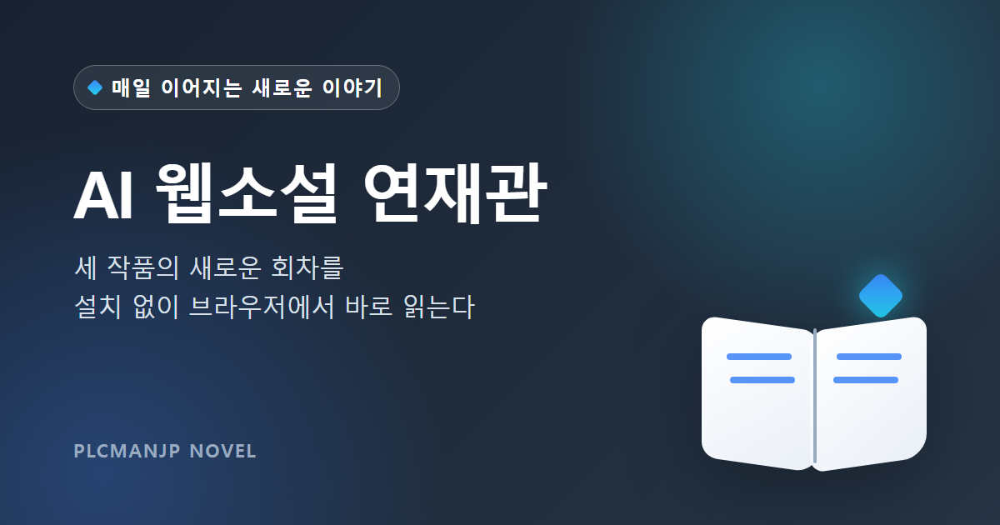
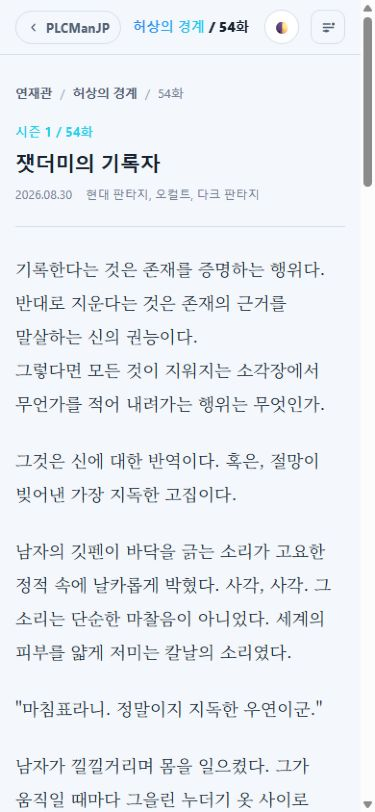

# AI 웹소설 연재관

세 작품의 새로운 이야기를 별도 설치 없이 브라우저에서 바로 읽을 수 있는 웹소설 연재관입니다. 작품을 고르고 첫 화부터 정주행하거나 최신 공개 회차부터 이어서 읽을 수 있습니다.

**[AI 웹소설 연재관에서 바로 읽기](https://plcmanjp.github.io/novel/)**

## 연재 작품

### [허상의 경계](https://plcmanjp.github.io/novel/#/s/hollow-observer)

현대 판타지, 오컬트, 다크 판타지

평범한 일상 뒤에 숨은 균열을 보는 소년의 이야기입니다. 세계의 정의마저 지우는 힘이 그를 금지된 진실로 이끕니다.

### [서툰 계절의 끝에서](https://plcmanjp.github.io/novel/#/s/awkward-season)

러브코미디, 로맨스, 학원물

가장 가까웠기에 더 서툴어진 두 사람의 이야기입니다. 다시 만난 계절 속에서 멀어진 거리와 감춰 둔 마음이 천천히 움직이기 시작합니다.

### [잿불의 검](https://plcmanjp.github.io/novel/#/s/ash-blade)

정통 판타지, 성장물, 모험

모든 것을 잃고 검 한 자루만 남은 소년 카엘의 이야기입니다. 동료들과 함께 잿빛 세계를 헤치며 자신의 운명을 벼려 나갑니다.

## 읽는 방법

1. 연재관에서 원하는 작품을 선택하세요.
2. 처음부터 읽으려면 `1화부터`, 새 이야기를 확인하려면 `최신화 읽기`를 선택하세요.
3. 본문 아래의 `이전화`, `목록`, `다음화`로 회차를 이동하세요.

공개된 회차만 목록에 표시됩니다. 회차 번호가 이어지지 않는 구간에서도 이전화와 다음화 버튼은 실제 공개 순서에 맞춰 이동합니다.

## 편안하게 읽기

- 라이트 테마와 다크 테마를 전환할 수 있습니다.
- 회차 화면의 읽기 설정에서 글자 크기와 줄 간격을 조절할 수 있습니다.
- 선택한 테마와 읽기 설정은 현재 브라우저에 저장됩니다.
- 데스크톱과 모바일 브라우저에서 같은 작품과 회차를 읽을 수 있습니다.

## 모바일 화면

작은 화면에서도 작품 정보와 본문을 한 흐름으로 읽고 상단 버튼에서 테마와 읽기 설정을 바꿀 수 있습니다.

## 이용 안내

- 새 회차가 공개되면 작품 목록과 최신화가 자동으로 갱신됩니다.
- 작품 목록이나 본문이 보이지 않으면 브라우저에서 JavaScript가 켜져 있는지 확인하세요.
- 모든 회차는 AI가 생성한 창작물입니다.
